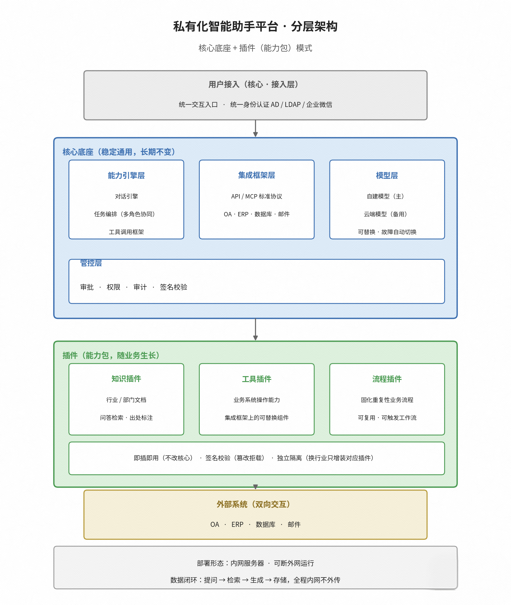

# Private Agent POC — 私有化 Agent 开发运行框架

**版本：v0.17.9**（2026-10-10）

最小可运行的私有化 Agent 框架：**vLLM（Qwen 27B）+ LangGraph（Agent 循环 + 多 Agent 编排）+ MCP（工具协议）+ Skills（技能系统）+ 对话式自定义工具 + 人工审批流 + 代码沙箱 + Langfuse 观测 + FastAPI（SSE 流式接口）+ 离线聊天前端**。

## 版本记录

- **v0.17.9**：多用户权限收紧——① **审批决议权分离**：普通账号不再能批准任何审批（含自己发起的），批准/拒绝只能由审批/管理员角色执行，「使用 Agent 的人」与「有权批准危险操作的人」彻底分开，杜绝自批漏洞；② **专属技能**：普通账号聊天中创建的技能只归本人可见可用（其他账号与管理角色各看各的），同名时以通用技能优先，普通账号也不能创建与通用技能同名的技能；他人专属技能的文件不可读取、不可删除；管理员与审批角色不受限制，技能包导入同样按身份分流。技术明细见 SECURITY.md（2.4、3.18）与 AUTH_DESIGN.md §4.1。

- **v0.17.8**：全面架构与代码评审后的修复批次 + **上传/产出多用户隔离**——上传文档与 AI 产出文件按登录账号分目录存放：普通账号只能访问自己的文件，审批/管理角色可跨账号查阅，历史存量文件自动归入公共目录、旧下载链接继续可用；修复长会话在特定长度区间历史被静默裁剪的问题；技能包导入/技能创建的返回信息不再暴露服务器部署路径；文件名非法字符、保留设备名、超大文件、恶意构造的 Word/压缩包一律前置拒绝并给出可理解提示；技能包覆盖导入失败不再损坏原有技能，覆盖创建技能不再残留旧附属文件；技能连续快速更新后立即生效；上传/产出文件不再纳入版本库；另有若干稳定性小修。技术明细见 SECURITY.md（3.15-3.17、6.7、八）与 CODE_REVIEW.md 修复记录。

- **v0.17.7**：文档上传与文档驱动开发——① **前端 📎 上传**：`POST /api/uploads`（raw body，文件名走查询参数，零新增依赖），文件落 `TOOL_WORKSPACE/uploads/`（读边界内，模型用既有 `read_text_file` 直接可读，无需新开读取通道）；② **`list_uploaded_docs` 内核工具**：列出已上传文档清单（主 Agent 与多 Agent worker 均可用），配合 `read_text_file` 构成模型侧文档访问通道；③ **系统提示词注入上传指引**（`config.UPLOAD_PROMPT`，装配时无条件追加，自定义 SYSTEM_PROMPT 不丢失）：分析严格基于文档实际内容，可按文档创建自定义工具/技能/领域包；④ **上传安全边界**：文件名清洗（剥路径成分 + 白名单后缀 + 120 字限长，`.env`/`*.db` 等敏感名天然被白名单挡下）、单文件上限 `UPLOAD_MAX_MB`（默认 10MB）、路径穿越拒绝、认证模式下接口鉴权；⑤ **格式支持**：md/txt/csv/json/yaml/代码等纯文本原样落盘，`.docx` 标准库解包提取正文（段落换行 + 实体还原，零第三方依赖，落盘为 `<原名>.docx.md`），PDF 明确 400 拒绝并引导转换（不假装能读）；⑥ **配套接口**：`GET /api/uploads` 清单、`DELETE /api/uploads/{name}` 删除（仅限 uploads/ 目录内）；⑦ **技能包 zip 上传**（`POST /api/skillpacks`）：目录型技能的标准传输形态——📎 识别 `.zip` 走服务端安全解包直接挂载 `skills/<name>/`（SKILL.md + references/ 等多文件结构），安全三件套：条目路径防穿越（zip-slip）、条目数 200/解压后 20MB 上限（防 zip 炸弹）、扩展名白名单（拒可执行二进制）；技能名取 SKILL.md frontmatter（与 create_skill 同一命名白名单），已存在走同一冲突语义（409，前端确认后 overwrite 覆盖整目录替换）；**技能签名纳入图重建检测**（`skills.signature`：全部 SKILL.md 相对路径+mtime）——技能包导入与模型 create_skill 后下一轮对话自动重绑生效，修复旧版「新技能要重启才被发现」缺口；⑧ **模型产出文件下载通道**：内核工具 `save_output_file(name, content)`（主 Agent 与 worker 同权）把整理/生成结果落盘 `TOOL_WORKSPACE/outputs/` 并返回 `/api/files/<名>` 下载链接（文件名与上传同规则：basename 剥离 + 白名单后缀 + 120 字限长，`.env`/`*.db` 敏感名天然被挡）；**Word 交付**：`as_docx=true` 时内置公文排版转换器（零第三方依赖手写最小 OOXML 包：标题居中二号方正小标宋、「一、」黑体三号、「（一）」楷体三号、正文仿宋三号、首行缩进 2 字符、固定行距 28 磅，XML 转义防注入）生成 `.docx`；`GET /api/files/{name}` 只暴露 outputs/ 目录（不开放 uploads/ 与工作区其余路径），认证由全局中间件强制，docx 返回标准 wordprocessingml 类型 + 附件下载语义；前端把回复中的 `/api/files/` 链接渲染为可点击下载（认证模式下带凭据 fetch + blob 触发，`<a href>` 直链不带 Bearer 头会 401）；配套首个应用技能 `gongwen-format`（生成符合公文格式的 Word 文档：读上传文稿 → GB/T 9704 风格整理 → as_docx 保存交付 + 链接，缺项提醒不编造）；⑨ **思维链展示与输入锁定**：推理模型（DeepSeek v4/reasoner 类）的思维链默认被 langchain-openai 通用转换器丢弃——自定义 `_ReasoningChatOpenAI` 最小子类把 `delta.reasoning_content` 挂回 `additional_kwargs`，流式管线透出 `reasoning` 事件，前端渲染为「💭 思考中…」折叠块（回答开始后自动收起，点击可展开回看），思考内容不落库；流式期间前端锁定输入框/发送/上传按钮（对话本质串行，防并发消息插队），完成后恢复；gongwen-format 技能交付规则强化——每次保存（含修订重存）后必须原样给纯文本下载链接，禁止代码块包裹/「见之前链接」/指导用户拼接 URL；⑩ **部署路径脱敏**：技能/自定义工具/领域包的创建、更新、删除返回值与冲突报错一律改用逻辑路径（`skills/<名>/SKILL.md`、`custom_tools/<名>.py`、`packs/<名>`），服务器绝对路径（盘符/用户目录/部署位置）不再进入对话与模型视野；系统提示词同步约束模型交流只讲逻辑路径（部署布局属内部信息）；工具返回展示改为预览+点击展开完整内容；⑪ **上下文压缩**：长会话按 token 而非轮数触发（历史估算超「模型窗口 × 60%」默认 76.8k 时）——`pre_model_hook` 只改**模型视野**：滑动窗口保底（近 `CONTEXT_RECENT_TOKENS` 8k token 永不裁、切割点成对完整性保护不悬空工具调用）+ 窗口外旧消息**滚动摘要**（独立 LLM 调用合并旧摘要与新增段，滞回 `CONTEXT_SUMMARY_HYSTERESIS_TOKENS` 4k 内不重摘防每轮烧 token），checkpointer 原始历史完整保留（界面恢复/审计/断点续跑不受影响），摘要失败自动回退纯窗口模式；E2E 实测：40 轮会话模型只能回忆窗口内编号，压缩后早期编号从摘要正确召回，界面历史无损

- **v0.17.6**：架构评审遗留低危项（P3）修复 + 认证默认联动运行模式——① **沙箱令牌常数时间比较**：`check_token` 的 `!=` 改 `hmac.compare_digest`，比较耗时不再随前缀匹配长度变化，堵住计时侧信道逐字节猜令牌的的理论路径（与 Agent 侧 HMAC 校验口径统一）；② **观测失败可恢复**：Langfuse 连接失败不再「一次检查、永久停用」，改为 60s 冷却期后自动重试（`RETRY_COOLDOWN`）——观测服务后启动或临时宕机恢复后，埋点无需重启即可接回，冷却期内不重复探测、不阻塞主链路；③ **会话租约有界等待**：`SessionLease` 获取租约此前无上限轮询，同会话另一请求长时间持有（如审批 resume 挂起）时新请求无限挂起且用户零反馈——现按 `LEASE_ACQUIRE_TIMEOUT`（默认 120s）超时，向用户返回「租约被占用，请稍后重试」错误事件；④ **登录限流跨进程**：失败计数与锁定状态从进程内存迁到 STATE_DB `login_fails` 表（旧库自动建表），多副本轮转打不同进程不再能绕过 30 秒锁定，容量上限与保底清空语义不变（跨机多副本仍应由前置网关统一限流）；⑤ **认证默认联动运行模式**：`AUTH_ENABLED` 默认值不再固定 false——Mock 模式（`MOCK_LLM=true`）= 开发者模式默认免登录直接进入，真实 LLM 模式默认要求登录（生产链路必须认证），显式设置 `AUTH_ENABLED` 可覆盖（如真实模式本地调试免登录）；真实模式首次启动须配 `AUTH_BOOTSTRAP_ADMIN` 或用 manage_users.py 建用户，否则无人能登录

- **v0.17.5**：架构评审修复（2×P1 + 2×P2，评审报告见 SECURITY.md 对应验收项）——① **审批 abandoned 宽限期**：周期扫描/启动清理只把决议时间超过宽限（审批超时 + 扫描间隔）的「已批准未执行」记录转 abandoned，刚批准正在 resume 执行的长任务不再被误标（误标后 mark_executed 静默失效、审计失真）；② **沙箱令牌不下发子进程**：`_run_isolated` 子进程环境剔除 `SANDBOX_AUTH_TOKEN`/`SANDBOX_OPEN_MODE`，沙箱内执行的不可信代码无法读走令牌伪造合法调用方；③ **删除敏感文件拦截**：`do_delete` 与 `read_text_file` 对称——`.env` 及变体、运行时 SQLite 库（state.db 承载会话/审批/租约锁）即使审批通过也拒绝删除，误删破坏并发控制与部署配置的路径关闭；④ **租约接管中止本轮流**：会话租约心跳发现被其他进程接管时，chat 流立即发 error 事件中止本轮（此前仅记日志继续跑，等于跨进程互斥失效、回到 checkpointer 写冲突场景），部分回复落库并标注「租约被接管」

- **v0.17.4**：安全审计修复（F1/F2/F3）——① **F1 敏感信息防外泄**：`read_text_file` 双防护——`.env` 及变体（`.env.*`）与运行时 SQLite 库（`*.db`/`*-wal`/`*-shm`）一律拒绝读取，其余内容按行掩码密钥值（键名含 token/key/secret/password 等敏感词的键值行值统一脱敏），工具代码/配置文件里的硬编码密钥不再外泄到对话；② **F2 SSO 身份头伪造封堵**：身份头新增来源校验——配置 `AUTH_PROXY_ALLOWED_IPS` 受信代理 IP/CIDR 白名单，仅来源命中白名单的请求才信任身份头（否则忽略并记日志，fail-closed），任何人直连 Agent 端口都无法伪造身份头冒充 admin 等既有用户；启动时若配置了 `AUTH_IDENTITY_HEADER` 却未配白名单，明确 WARNING 提示身份头不生效；③ **F3 沙箱令牌 fail-closed**：沙箱未配置 `SANDBOX_AUTH_TOKEN` 时 `/run`、`/run_tool` 默认拒绝执行（503），不再静默开放——生产必须配置令牌，仅兼容存量未鉴权部署可显式 `SANDBOX_OPEN_MODE=true` 临时放开（compose/.env.example 同步说明）

- **v0.17.3**：低危级体检修复——① **周期扫描异常容错**：审批 abandoned 周期扫描单次失败只记日志继续（后台任务不再可能静默死亡，兜底永久失效）；② **登录限流表容量上限**：内存限流表加 10k 容量控制，随机用户名刷失败记录不再无限增长内存（极端超限时清空重计，PBKDF2 仍兜底暴力破解）；③ **租约心跳丢失日志**：会话租约被接管时打印日志供诊断（本进程可能仍在推进对话）；④ 启动清理日志文案同步（pending→expired 与 approved 未执行→abandoned 一并统计）

- **v0.17.2**：架构评审中危项修复——① **审批执行连续性追踪**：`approvals` 表新增 `worker_id`（发起进程 hostname:pid）与 `executed_at`（完成 resume 的时间，旧库自动迁移）；Agent 把批准决议带进图并完成 resume 后标记 executed，启动/周期扫描把「已批准但从未执行」的记录转为 `abandoned` 状态（审计可见「已批准但执行丢失」，fail-closed 绝不补执行），审批列表与前端展示新状态及执行信息；② **领域包 env 注入防静默覆盖**：跨包声明同名 env 键时加载即 WARNING 点名两包与值并注明生效方（进程 env 只有一份，setdefault 先到先得）；③ **登录失败限流**：连续失败 5 次锁定账号 30s（内存级按用户名，锁定期内一律拒绝，返回仍与失败同路径的模糊响应，防枚举语义不变）；④ **部署文档**：DEPLOY_RUNBOOK 注明手工向 `packs/` 放包**不会热生效**（扫描有内存缓存），须重启或走对话式创建流程；⑤ **SQLite 共享存储措辞收紧**：WAL + busy_timeout 只保证**同机多进程**共享同一库文件，跨机多副本须替换为 Postgres——README/config/sessions/approval/.env.example/PRODUCTION 同步澄清

- **v0.17.1**：架构评审高危项修复——① **沙箱出网面收敛**：新增 `sandbox/entrypoint.sh` 在容器网络命名空间内用 iptables 封锁出站（仅放行回环与入站响应，沙箱内代码无法访问外网/内网，入站连接不受影响），Agent↔沙箱新增共享令牌鉴权（`SANDBOX_AUTH_TOKEN`，`/run`、`/run_tool` 强制校验 `X-Sandbox-Token`，fail-closed，未配置保持开放兼容既有部署）。已在本机 Docker Desktop 实测：沙箱内 8.8.8.8:53/1.1.1.1:443 均超时（宿主机对照可达）、无/错令牌 401、正确令牌正常执行。注：曾试过 `internal: true` 网络，实测 Docker 的 internal 网络与主机端口发布不兼容（docker-proxy 无法桥接，9001 不监听），已弃用并在 compose 注释中说明；② **同会话串行化跨进程落地**：新增 `server/session_lock.py`（STATE_DB 后端分布式租约锁，租约+心跳，worker 崩溃自动接管），chat 流「进程内 asyncio 锁 + 跨进程租约」双重互斥，多副本共享 STATE_DB 时同会话并发请求真正排队（v0.16.4 的串行化承诺不再只限单进程）

- **v0.17.0**：知识库接入参考实现（RAG as a Tool）——`tools/build_kb.py`（纯 Python BM25 建索引：中文 bigram 分词、Markdown 标题切块、SQLite 单文件、零第三方依赖）；`core-knowledge` 平台包（公司通用知识库，跨领域共用、始终在线）+ `kb-demo` 领域包样例（HR 制度库）；示例制度文档 4 份（kb/common + kb/hr）；检索结果带「文档名·章节」来源标注（防幻觉可审计）；知识数据放包目录外（更新重跑建索引即可，不碰签名）；真实模型跨库问答实测：一次提问自动并联检索 HR 库与通用库、合并作答、双出处标注；PACK_GUIDE.md 新增「知识库接入」一章（两层归属 + 接入 5 步 + 关键设计点）
- **v0.16.5**：领域包开发指南（PACK_GUIDE.md）——接业务的预备文档：领域包目录结构、三种创建方式、七步开发流程（能力边界→骨架→工具→技能→提示词→清单→测试/审计/签名/上线）、pack.yaml 全字段速查、工具编写硬性规范（自包含/签名即接口/返回 str/密钥走环境变量）、完整 HR 请假包示例、治理规则与常见问题
- **v0.16.4**：同会话并发串行化——同一 session_id 的并发请求按会话锁排队执行（对话本质串行，并行会导致 checkpointer 状态写冲突与记录交错）；不同会话互不干扰；用户消息落库移入锁内保证记录顺序与执行顺序一致；锁表超阈值自动清理防内存膨胀；压测脚本新增 `session` 场景（同会话并行 N 请求验证串行化，19 轮消息严格 user/assistant 交替）
- **v0.16.3**：文档收官——新增《分步部署执行手册》DEPLOY_RUNBOOK.md（GPU+Docker 生产机 10 步上线：每步可复制命令 + 验收点 + 回滚预案）；新增《功能介绍》FEATURES.md（两版：技术讲解版 → 已改写为管理层汇报版——业务价值/风险管控/成本可控/投入产出视角，去技术术语）；PROMO.md 补企业级多用户亮点并更新版本
- **v0.16.2**：安全与可信核查清单（SECURITY.md）——把审批流、执行/文件边界、包签名、认证、审计、fail-closed 语义串成 7 章 30 项可验收检查表（每项含验证方法与预期）；本版实测复核 9 项：无凭据 401、凭据只存散列、危险操作触发审批、批准后越界删除仍被拒（审批≠边界放行）、重启残留 pending 自动 expired、审批审计字段（user_id/decided_by）、代码执行 fail-closed、读/删路径边界、分发包无敏感物
- **v0.16.1**：并发压测与事件循环解阻（报告见 CONCURRENCY.md）——新增 `tools/load_test.py`（asyncio 阶梯并发压测：health/chat 双场景，p50/p95/吞吐报告）；修复「同步 IO 阻塞事件循环」并发瓶颈：认证解析、会话落库、健康检查的 SQLite/文件 IO 挪入线程池（`asyncio.to_thread`），`scan_packs` 增加内存缓存（create/delete/sign 失效）；轻端点吞吐 24.6→70.1 req/s（+185%）、p95 延迟 5951→878ms（-85%）
- **v0.16.0**：SSO 钩子（AUTH_DESIGN §七 清零）——身份解析收敛为唯一入口 `auth.resolve_identity`，企业接入新身份源只需在该函数加分支（角色判断/ACL/审批审计/token 计量零改动）；内置反向代理身份头模式：配置 `AUTH_IDENTITY_HEADER`（如 X-Forwarded-User）后信任上游网关注入的用户名，角色仍查本地用户表（认证在外、授权在内），用户不存在/已吊销 fail-closed 401，身份头优先于 Bearer 凭据、无身份头时 pak-/pat- 凭据照常工作
- **v0.15.0**：账号密码登录（AUTH_DESIGN §七 再核销一项）——凭据双轨：API Key（pak-，脚本/服务调用）+ 登录令牌（pat-，浏览器人工使用）；`api_users` 加 `password_hash` 列（PBKDF2-SHA256 加盐，NULL=禁用密码登录，旧库自动迁移）；`POST /api/auth/login` 签发短期令牌（默认 12 小时，`AUTH_TOKEN_TTL_HOURS` 可调），`POST /api/auth/logout` 注销；登录失败不区分「用户不存在/密码错误」（防枚举），吊销用户同步清除其令牌；前端认证模式改弹登录框（账号密码登录 / 粘贴 API Key 双入口 + 注销按钮）；CLI 新增 `passwd` 命令，`list` 显示密码状态
- **v0.14.2**：Key 过期与轮换（AUTH_DESIGN §七 再核销一项）——`api_users` 增加 `expires_at` 列（旧库自动 ALTER 迁移，NULL = 永不过期）；签发支持 `--days N` 指定有效期；新增 `rotate` 命令为已有用户换发新 Key（旧 Key 立即失效，可顺带重置有效期）；过期 Key 请求一律 401；`list` 显示状态（正常/已吊销/已过期）与过期时间
- **v0.14.1**：资源级 ACL（AUTH_DESIGN §七 首项落地）——认证模式下 user 角色的数据面收窄：会话列表/历史/删除仅限本人会话（历史与删除越权返回 403），审批列表仅见自己创建的，用量统计强制按本人过滤（查询参数不可越权）；approver/admin 保持全局视图；开放模式行为不变
- **v0.14.0**：API 认证与多用户（设计见 AUTH_DESIGN.md）——Bearer API Key 认证（pak- 前缀，库中只存 sha256，可吊销）；三级角色 user/approver/admin（使用 Agent 的人与能批准危险操作的人分离）；user_id 改由服务端中间件注入（计量归属不再可信客户端自报）；审批身份绑定（approvals 表加 user_id/session_id/decided_by 三列，旧库自动迁移，创建人/决议人全程可审计；user 只能决议自己创建的审批）；前端 Key 引导输入 + 身份徽章 + 审批面板身份列；用户管理 CLI（tools/manage_users.py）；AUTH_ENABLED=false 默认开放模式行为不变
- **v0.13.1**：评审修复——路径越界校验改 `Path.is_relative_to()`（根除兄弟目录前缀攻击与 Windows 盘符大小写误判，覆盖读文件/删文件/MCP 两处）；工具热重载探测移出事件循环（`asyncio.to_thread` + 锁串行化，并发会话不再被沙箱探测卡住）；usage 计量库补 WAL/busy_timeout（高并发落账不再静默丢账）；客户端断连时部分回复仍落库（finally 兜底 + 「连接中断」标记）；审批卡片可恢复（记录面板 pending 条目直接决议 + 页面加载待审批提醒）。附《代码评审报告》CODE_REVIEW.md
- **v0.13.0**：架构重构 + 无状态化 + 信任模型——agent.py 拆分（tools_builtin/tools_admin/mock 三模块 + AppState 收口全局态 + 审批门 require_approval 收敛 7 处样板）；会话与审批迁 SQLite（STATE_DB，重启不丢、跨进程可决议、审批状态机 pending/approved/rejected/expired + 审计接口）；修复真实模式上下文重复缺陷（历史改由 checkpointer 接续）；包可信签名（PACK_SIGNING_KEY 强制模式：未签名/篡改整包不加载；create_pack 审批落盘自动签名；sign_pack 工具/CLI；permissions 权限声明显示在审批卡片）；前端会话历史恢复（刷新/重启后自动恢复聊天记录 + 「☰ 记录」面板：会话切换/新会话/审批记录）
- **v0.12.0**：能力分层——平台包（pack.yaml `platform: true`：跨领域通用基础能力，始终启用、运行时不可禁用、先于领域包加载；时间/计算工具从内核迁为首个平台包 `core-utils`，内核只留运行时管理与安全边界工具）
- **v0.11.0**：Token 计量（按 用户/任务/会话 三维度记录每次模型调用消耗，LangChain 回调 + contextvars 归属，SQLite 零依赖存储；`/api/usage` 聚合查询；前端展示本次/会话累计消耗；多 Agent worker 调用单独标记）
- **v0.10.0**：领域包第三期——包级配置（pack.yaml 支持 `env` 默认值注入（外部显式设置优先，沙箱模式随 `/run_tool` 透传隔离子进程）与 `requires_modules` pip 依赖声明，缺失时整包 fail-closed 不加载）
- **v0.9.0**：领域包第二期——包脚手架（聊天中对话式创建/删除领域包，模型现场编写 pack.yaml + 工具代码，审批落盘免重启挂载；`core_version` 内核版本约束强制校验）
- **v0.8.0**：领域包架构（Domain Pack：通用内核 + 可插拔领域能力。`packs/<名称>/` 一个目录打包工具+技能+提示词，运行时启用/禁用免重启；天气能力抽为首个示例包 `weather-ops`）
- **v0.7.0**：LLM 网关（LiteLLM Proxy：多模型路由 + 主备 fallback + RPM 限流 + 统一审计，对 Agent 透明）
- **v0.6.0**：多 Agent 编排（orchestrator-worker 子图：拆题 → Send 并行调研 → 汇总，`research_topic` 工具触发）
- **v0.5.0**：checkpointer 可切换 PostgresSaver（会话/审批现场持久化，重启不丢；`CHECKPOINTER=postgres` + `DATABASE_URL`）
- **v0.4.1**：自定义工具沙箱隔离执行（`/run_tool` 端点 + 只读挂载 + ast 静态签名，主进程零执行；沙箱宕机自动回退/恢复）
- **v0.4.0**：对话式自定义工具（聊天中让 Agent 编写 Python 工具，审批落盘 + 免重启热加载）
- **v0.3.2**：天气查询多数据源降级链（Open-Meteo 主源 → itboy 兜底源，内置/MCP 两通道共用 `server/weather.py`）
- **v0.3.1**：修复审批流 interrupt 被 `except Exception` 吞掉的问题（GraphBubbleUp 需直接放行）；DeepSeek 云端真实联调通过
- **v0.3.0**：Skills 技能系统（制作/使用/渐进式披露）
- **v0.2.0**：人工审批流（fail-closed）、代码沙箱、Langfuse 观测、服务状态灯
- **v0.1.0**：基础链路（vLLM + LangGraph + MCP + SSE + 天气工具）

## 架构



```
浏览器 (web/index.html, 零 CDN 依赖，可断网运行)
   │  SSE 流式
   ▼
FastAPI 服务 (server/main.py)
   │  会话记忆 / 事件转发
   ▼
LangGraph ReAct Agent (server/agent.py)  ← 通用内核：不含任何领域逻辑
   │  工具调用                │  OpenAI 兼容接口
   ▼                          ▼
内置工具 + MCP Server      vLLM 推理服务
+ 自定义工具 + 领域包       (docker-compose.yml,
(packs/ 可插拔领域能力)      Qwen 27B + hermes 工具解析)
```

## 目录结构

```
agent-poc/
├── server/
│   ├── main.py            # FastAPI 入口：/api/chat (SSE)、/api/health、/api/sessions、/api/approvals、静态页面
│   ├── agent.py           # LangGraph 图装配、checkpointer 生命周期、SSE 流式编排（v0.13.0 瘦身后）
│   ├── state.py           # AppState：进程级运行时状态唯一属主（v0.13.0）
│   ├── tools_builtin.py   # 内核工具：读文件/沙箱执行/删文件（安全边界最小集合，v0.13.0）
│   ├── tools_admin.py     # 管理类工具：技能/自定义工具/领域包/多 Agent + 装配清单（v0.13.0）
│   ├── mock.py            # Mock 演示剧本（与生产链路隔离，v0.13.0）
│   ├── packs.py           # 领域包注册中心（扫描/校验/挂载/启停/签名）
│   ├── packsign.py        # 包可信签名（HMAC-SHA256，v0.13.0）
│   ├── custom_tools.py    # 自定义工具注册中心（校验/落盘/热加载；含沙箱/本地构建器，领域包复用）
│   ├── skills.py          # Skills 注册中心（内核 skills/ + 领域包 skills 多源合并）
│   ├── sessions.py        # 会话历史持久化（SQLite/STATE_DB，重启不丢，v0.13.0）
│   ├── session_lock.py    # 跨进程会话租约锁（STATE_DB 后端，多副本同会话串行化，v0.17.1）
│   ├── approval.py        # 审批中心（DB 持久化 + 状态机 + 审批门 require_approval，v0.13.0）
│   ├── auth.py            # API 认证与多用户（双轨凭据/角色/ACL/SSO 身份头，v0.14.0–v0.16.0）
│   ├── usage.py           # Token 计量（LangChain 回调采集 + SQLite 存储聚合，v0.11.0）
│   ├── weather.py         # 天气多数据源降级链（MCP 示例服务器共用）
│   └── config.py          # 全部配置走环境变量
├── packs/                 # 包目录（可插拔能力：平台包 + 领域包）
│   ├── core-utils/        # 平台包（platform: true，不可禁用）：时间/计算等通用能力
│   ├── core-knowledge/    # 平台包：公司通用知识库检索（RAG as a Tool，v0.17.0）
│   ├── kb-demo/           # 领域包样例：HR 制度知识库检索（v0.17.0）
│   └── weather-ops/       # 领域包示例：气象领域
│       ├── pack.yaml      #   清单（名称/版本/依赖/能力声明）
│       ├── prompt.md      #   领域提示词片段（注入系统提示词）
│       ├── tools/         #   领域工具（get_current_weather）
│       └── skills/        #   领域技能（weather-report）
├── custom_tools/          # 对话式创建的自定义工具（.py 即工具，免重启生效）
├── kb/                    # 知识库源文档（common/ + hr/，tools/build_kb.py 建索引，v0.17.0）
├── tools/
│   ├── local_tools_server.py  # 示例 MCP Server（stdio）：目录列举、字数统计、MCP 天气
│   ├── build_kb.py        # 知识库建索引 CLI（纯 Python BM25，零第三方依赖，v0.17.0）
│   ├── manage_users.py    # 用户管理 CLI（签发/轮换/吊销 Key、passwd，v0.14.0）
│   ├── load_test.py       # 并发压测（health/chat/session 场景，v0.16.1）
│   └── sign_pack.py       # 管理员 CLI：包签名（v0.13.0）
├── sandbox/               # 代码执行沙箱服务（server.py + Dockerfile + entrypoint.sh 出网封锁，v0.17.1）
├── web/
│   └── index.html         # 聊天前端（内联样式脚本，内网离线可用）
├── docker-compose.yml     # vLLM 推理服务（GPU）
├── docker-compose.sandbox.yml   # 沙箱服务（含出网封锁与令牌鉴权）
├── requirements.txt
├── .env.example           # 复制为 .env 后按需修改
└── package.json           # npm run dev 快捷启动
```

## 自定义工具（对话式创建）

像 Skills 一样，工具也可以在聊天里让 Agent 现场编写：

1. 「帮我创建一个工具 dice_roll：掷 N 面骰子」→ 模型编写 Python 代码并调用 `create_custom_tool`
2. 写入可执行代码属危险操作 → **弹审批卡片**（含代码预览），批准后才落盘到 `custom_tools/`
3. 落盘后**免重启热加载**：每轮对话开头检测目录变化，自动重新绑定工具

约定：文件名即工具名，文件内定义同名函数，docstring 即工具描述（展示给模型），
参数带类型注解、返回 `str`（不支持 *args/**kwargs）。配套管理工具：`list_custom_tools` /
`create_custom_tool` / `delete_custom_tool`（删除同样需审批）。

**执行隔离**（`CUSTOM_TOOLS_EXEC=auto|sandbox|local`，默认 `auto`）：
配置了 `SANDBOX_URL` 且沙箱可达时，自定义工具**不在 Agent 主进程执行**——
主进程只用 ast 静态提取函数签名（零代码执行），实际调用通过沙箱服务的
`/run_tool` 端点在隔离子进程中运行（容器内只读挂载 `custom_tools/`，
CPU/内存/进程数限额）。沙箱宕机时 auto 模式自动回退本地执行，恢复后自动切回；
显式设置 `sandbox` 而沙箱不可达则 fail-closed 不加载自定义工具。

## 领域包架构（Domain Pack）

设计目标：**通用内核不含任何领域逻辑**，专业能力以「领域包」形式插拔——
换行业 = 换 `packs/` 下的目录，内核代码零改动。

**三层能力模型**（v0.12.0 起）：

| 层 | 放什么 | 治理 |
|---|---|---|
| 内核内置工具 | 运行时管理与安全边界：包/技能/自定义工具管理、审批类文件操作、多 Agent 编排 | 随内核发布，不可禁用 |
| **平台包**（`platform: true`） | 跨领域通用基础能力：时间、计算、文档解析、HTTP 抓取等（示例：`core-utils`） | 始终启用、**运行时不可禁用**（对话中 `disable_pack` 直接拒绝，模型通常读到工具说明即主动拒绝）、先于领域包加载（重名时领域包让路）；下线只能管理员在部署层移除目录 |
| 领域包 | 业务专业能力（示例：`weather-ops`） | 对话式建删/启停，挂审批 |

平台包与领域包**共用同一套打包机制**（pack.yaml + 工具/技能/提示词/env/依赖声明），
只是治理策略不同——不引入第二种插件机制。

```
packs/<包名>/
├── pack.yaml      # 清单：name/version/description/core_version/platform/
│                  #   requires_env/requires_modules/env/tools/skills/prompt
├── tools/*.py     # 领域工具（与 custom_tools 同一约定，文件必须完全自包含，
│                  #   不得 import server 模块——沙箱隔离子进程里没有 server 包）
├── skills/*/      # 领域技能（SKILL.md，并入全局技能索引，渐进式披露）
└── prompt.md      # 领域提示词片段（注入系统提示词）
```

pack.yaml 完整字段：

| 字段 | 必填 | 说明 |
|---|---|---|
| `name` / `version` / `description` | 是 | 包名须与目录名一致（小写字母/数字/连字符） |
| `platform` | 否 | `true` 标记为平台包（跨领域通用能力；始终启用、不可禁用、优先加载），缺省为领域包 |
| `core_version` | 否 | 内核版本约束（`>=0.8.0` 或精确版本），不满足整包不加载 |
| `requires_env` | 否 | 必须由部署方提供的环境变量名（如密钥），缺失整包不加载 |
| `requires_modules` | 否 | 依赖的 Python 模块名（pip 依赖声明），缺失整包不加载——私有化环境**不自动安装**，请先装入 Agent venv 或打入沙箱镜像 |
| `env` | 否 | 包级环境变量默认值：外部（.env/系统）显式设置优先，否则注入包声明的默认值；local 模式注入进程环境，sandbox 模式随 `/run_tool` 透传给隔离子进程（变量名校验 + 值长度限制） |
| `permissions` | 否 | 权限声明列表（如 `["network", "filesystem"]`）：信息性声明，展示在 `list_packs` 与启用/创建审批卡片上，供审批人知情决策；执行层强制由沙箱与审批门负责 |
| `signature` | 否 | HMAC-SHA256 内容签名（由 create_pack 自动签名 / sign_pack 工具 / tools/sign_pack.py 写入，见下文「信任模型」） |
| `tools` / `skills` / `prompt` | 否 | 能力声明（相对包目录路径） |

能力映射（包内每一项挂到哪个内核注册中心）：

| 包内容 | 挂载到 | 生效方式 |
|---|---|---|
| `tools/*.py` | 工具注册中心（复用 custom_tools 的构建器） | 沙箱/本地双模式；沙箱走 `/run_tool` 的 `pack` 字段 |
| `skills/` | Skills 注册中心（多源合并） | 技能索引注入提示词，`load_skill` 拉取全文 |
| `prompt.md` | 系统提示词 | 重建图时拼接 |

管理与验证（首个示例包 `weather-ops` = 原内置天气能力整体搬迁）：

- 聊天中说「**创建一个领域包 xxx**」→ 模型现场编写 pack.yaml + 工具代码 →
  弹审批 → 批准落盘 → **免重启热挂载**，下一轮对话即可使用包内工具；
  说「**删除 xxx 包**」→ 审批后整个包目录删除（不可恢复，模型会先二次确认）。
  配套管理工具：`create_pack` / `delete_pack` / `list_packs` /
  `enable_pack` / `disable_pack`（后四个均挂审批，create_pack 也挂审批）。
- 聊天中说「**禁用 weather-ops 包**」→ 弹审批 → 批准后其工具/技能/提示词立即从
  Agent 消失（免重启，运行时内存态）；「**启用 weather-ops 包**」恢复。
- 持久化配置：`ENABLED_PACKS` 逗号分隔白名单（留空 = 全部加载），重启后以此为准。
- `requires_env` 声明依赖的环境变量，缺失时整个包标为 `unavailable` 不加载
  （例如某包依赖内网数据服务凭证）。
- `core_version` 声明内核版本约束（`>=0.8.0` 或精确版本），
  不满足时整包标为 `unavailable` 不加载——防止新包挂到旧内核上出隐性故障。
- `/api/health` 的 `packs` 字段展示全部包及状态。
- 工具名不做命名空间（LangChain 工具名不允许点号），跨包重名 → 跳过并告警。
- 注意：MCP 示例服务器的 `get_city_weather` 保留在内核（MCP 机制演示用），
  禁用 weather-ops 后模型可能改用它查天气——这是预期行为，两条通道是独立演示。

### 信任模型（包签名，v0.13.0 起）

包是可执行代码的分发单元，需要可信来源保证：

| 模式 | 触发条件 | 行为 |
|---|---|---|
| 开放模式（默认） | 未配置 `PACK_SIGNING_KEY` | 与旧版一致，所有合法包均可加载；`list_packs` / `/api/health` 展示信任状态（`signed` / `unsigned` / `invalid` / `signed-unverified`） |
| **强制模式** | `.env` 配置 `PACK_SIGNING_KEY` | 只有带有效 HMAC-SHA256 签名的包才加载；未签名 / 篡改 / 签名无效 → 整包 `unavailable`（fail-closed），原因可见 |

信任链（包如何获得签名）：

1. **对话式 create_pack**：内容已过人工审批 → 落盘即自动签名（可信路径）；
2. **手工放入的包**：管理员审计代码后，用对话工具 `sign_pack`（挂审批）或
   CLI `python tools/sign_pack.py <包名>`（`--all` 签全部）签名；
3. **篡改即失效**：签名覆盖 pack.yaml + tools/ + skills/ + prompt.md 全部内容，
   任何修改使签名失效，热重载时整包不可用（`/api/health` 可见原因），审计后重新签名才能恢复。

部署注意：签名与密钥绑定。分发打包时若更换密钥，部署方需用自己的密钥重新执行
`tools/sign_pack.py --all`（包内签名在开放模式下不阻碍加载，仅展示为 `signed-unverified`）。

## 快速开始（Mock 模式，无需 GPU，5 分钟跑通）

```bash
cd agent-poc
python -m venv .venv
.venv/Scripts/pip install -r requirements.txt -i https://pypi.tuna.tsinghua.edu.cn/simple
cp .env.example .env        # 默认 MOCK_LLM=true
.venv/Scripts/python.exe server/main.py        # 或 npm run dev
```

打开 http://localhost:7100 ，问一句「现在几点」或「北京天气怎么样」可以看到完整的
**流式输出 + 工具调用事件**链路（Mock 模式下时间为模拟、天气为真实 Open-Meteo 接口数据）。

界面对比两种工具扩展方式：

- 「北京天气怎么样」→ 走**内置工具** `get_current_weather`（Agent 进程内调用）
- 「用 MCP 查北京天气」→ 走 **MCP 工具** `get_city_weather`（独立子进程 stdio 调用）

界面上的工具调用标签会显示实际调用的工具名，可直观区分两条链路。

## 接入真实模型

### 方案 B（无 GPU 机器的临时方案）：DeepSeek 云端 API

任何 OpenAI 兼容接口都能接入，DeepSeek 为例（**数据会发送到云端，仅用于开发联调，
正式私有化部署必须切回方案 A**）：

```
MOCK_LLM=false
LLM_BASE_URL=https://api.deepseek.com/v1
LLM_API_KEY=sk-你的密钥
MODEL_NAME=deepseek-chat        # 或 deepseek-reasoner（R1 推理模型）
```

改完 `.env` 重启即可。`deepseek-chat` 支持 function calling，框架的工具调用、
审批流、Skills 全链路都会走真实模型。

### 方案 A（生产私有化）：Qwen 27B + vLLM

1. 准备 GPU 机器与模型权重（27B FP16 约需 54GB 显存 + KV cache；
   单卡 80G 或 2×24G 加 `--tensor-parallel-size 2`，显存不足用 AWQ/FP8 量化版）。
2. 把模型放到 `./models/Qwen3-27B`（或修改 compose 里的 `MODEL_DIR`/`MODEL_PATH`），然后：

   ```bash
   docker compose up -d vllm
   curl http://localhost:8000/v1/models     # 确认模型就绪
   ```

   > `--enable-auto-tool-choice --tool-call-parser hermes` 已配置，
   > 这是 Qwen 系列在 vLLM 下启用 function calling 的关键开关。

3. 修改 `.env`：

   ```
   MOCK_LLM=false
   LLM_BASE_URL=http://localhost:8000/v1
   MODEL_NAME=qwen-27b
   ```

4. 重启服务即可。已有其它 OpenAI 兼容端点时，直接改 `LLM_BASE_URL` / `MODEL_NAME` 指向它。

## 环境变量

| 变量 | 默认 | 说明 |
|---|---|---|
| `MOCK_LLM` | `true` | Mock 模式开关，无 GPU 时验证链路 |
| `LLM_BASE_URL` | `http://localhost:8000/v1` | OpenAI 兼容接口地址 |
| `LLM_API_KEY` | `EMPTY` | 接口密钥（vLLM 默认不校验） |
| `MODEL_NAME` | `qwen-27b` | vLLM `--served-model-name` |
| `TEMPERATURE` / `MAX_TOKENS` | `0.7` / `2048` | 采样参数 |
| `MCP_ENABLED` | `true` | 是否加载 MCP 工具服务 |
| `TOOL_WORKSPACE` | 项目根目录 | `read_text_file` 的访问边界（防越权） |
| `WEATHER_GEOCODING_URL` / `WEATHER_API_URL` | Open-Meteo 官方地址 | 天气主数据源（全球城市，免 key），内网可改为内部代理 |
| `WEATHER_TIMEOUT` | `10` | 天气接口超时（秒） |
| `WEATHER_ITBOY_ENABLED` | `true` | 兜底源开关：Open-Meteo 不可达时自动降级到 itboy 免费天气（国内区县，免 key） |
| `WEATHER_ITBOY_CITY_URL` / `WEATHER_ITBOY_API_URL` | itboy 官方地址 | 兜底源城市编码表与查询接口 |
| `SKILLS_DIR` | `./skills` | 技能目录（SKILL.md 渐进式披露） |
| `PERSONAL_SKILLS_DIR` | `./skills_personal` | 普通账号专属技能目录（v0.17.9，按身份分域 `<域>/<技能>/`，仅本人可见；勿纳入版本库） |
| `CUSTOM_TOOLS_DIR` | `./custom_tools` | 自定义工具目录（对话式创建，热加载） |
| `PACKS_DIR` | `./packs` | 领域包目录 |
| `ENABLED_PACKS` | 空（全部加载） | 包名白名单（逗号分隔），重启后以它为准 |
| `PACK_SIGNING_KEY` | 空（开放模式） | 配置后进入强制模式：未签名/篡改整包不加载（v0.13.0） |
| `SANDBOX_URL` | 空（拒绝执行） | 沙箱服务地址；未配置时 `run_python_code` fail-closed |
| `SANDBOX_AUTH_TOKEN` | 空 | Agent↔沙箱共享令牌（`X-Sandbox-Token`，v0.17.1）；沙箱侧未配置令牌时默认拒绝执行，仅 `SANDBOX_OPEN_MODE=true` 显式放开（v0.17.4 F3） |
| `STATE_DB` | `./state.db` | 会话/审批/租约锁 SQLite 库（v0.13.0；跨机多副本须换 Postgres） |
| `USAGE_DB` | `./usage.db` | Token 计量 SQLite 库（v0.11.0） |
| `CHECKPOINTER` | `memory` | `postgres` 可切换持久化（Windows 开发机仅支持 memory） |
| `AUTH_ENABLED` | 联动 `MOCK_LLM`（v0.17.6） | Mock=开发者模式默认免登录；真实模式默认要求登录；显式设置可覆盖。true 时 Bearer 凭据 + 三级角色 |
| `AUTH_IDENTITY_HEADER` | 空 | SSO 身份头（如 `X-Forwarded-User`，v0.16.0）；须配合 `AUTH_PROXY_ALLOWED_IPS` 白名单才生效（v0.17.4 F2） |
| `SYSTEM_PROMPT` | 见 config.py | 系统提示词（文档上传指引由 `config.UPLOAD_PROMPT` 装配时独立追加，不受覆盖影响） |
| `UPLOAD_MAX_MB` | `10` | 文档上传/产出单文件大小上限（MB，v0.17.7）；文件按身份分域落 `TOOL_WORKSPACE/uploads/<域>/`、`outputs/<域>/`（v0.17.8），开放模式 shared/ |
| `CONTEXT_COMPACT_ENABLED` | `true` | 上下文压缩开关（v0.17.7）：超触发线时窗口外旧消息滚动摘要，只改模型视野不动 checkpointer 历史 |
| `CONTEXT_MAX_TOKENS` / `CONTEXT_COMPACT_RATIO` | `128000` / `0.6` | 模型窗口与触发比例（默认触发线 76.8k，按实际模型窗口调整；启动日志打印） |
| `CONTEXT_RECENT_TOKENS` / `CONTEXT_SUMMARY_HYSTERESIS_TOKENS` | `8000` / `4000` | 永不裁的近期窗口 / 摘要重生成滞回（新增段不足不重摘） |

## 如何扩展一个业务工具

三种方式，任选（项目里均有可对照的示例实现）：

0. **对话式自定义工具**（零代码门槛）：直接在聊天里说「创建一个工具 xxx」，
   模型现场编写代码，审批落盘到 `custom_tools/` 后免重启生效（见上节）。
1. **内置工具**：在 `server/tools_builtin.py` 写一个带 docstring 的 Python 函数，
   加进 `tools_admin.py` 的 `builtin_langchain_tools()`（docstring 就是给模型看的工具说明书）。
   示例：`read_text_file` —— 与 Agent 同进程，调用延迟最低。
2. **MCP 工具**（推荐，进程隔离、可独立部署升级、可被任何 MCP 客户端复用）：
   在 `tools/local_tools_server.py` 用 `@mcp.tool` 加函数，或另起一个 MCP Server
   进程，Agent 端零改动。示例：`get_city_weather` —— 与内置版功能相同，
   自包含实现，接口地址同样支持 `WEATHER_API_URL` 环境变量。

> 注意：两种方式不要注册同名工具，避免模型工具路由冲突（本项目用
> `get_current_weather` / `get_city_weather` 区分）。

## Skills 技能系统（制作与使用）

技能是**可复用的任务指令包**，格式与业界 SKILL.md 约定一致：

```
skills/
└── weather-report/          # 示例技能：天气简报生成
    └── SKILL.md
        ---
        name: weather-report
        description: 一句话描述（模型据此判断何时使用）
        ---
        （Markdown 完整指令）
```

**使用（渐进式披露）**：系统提示词只注入技能索引（name + description），
模型判断任务匹配后调用 `load_skill` 拉取完整指令再执行——技能再多也不占上下文。

**制作**：三种方式任选——
1. 聊天制作（推荐演示）：直接说「创建一个技能」，Agent 调用 `create_skill` 写入 `skills/`
2. 手写文件：在 `skills/<名称>/SKILL.md` 按上面的格式编写
3. API 制作：`create_skill(name, description, instructions)` 工具

普通账号（user 角色）聊天创建的技能落**专属域**（v0.17.9）：仅本人可见可用，
不能占用通用技能名；管理员/审批角色创建的仍是通用技能（全员可见）。

相关工具：`list_skills_tool`（列出全部）、`load_skill`（加载指令）、
`create_skill`（创建，限制在 skills/ 目录内，名称仅允许小写字母/数字/连字符）。

Mock 模式可直接演示：「有哪些技能」/「创建一个技能」/「加载 weather-report 技能」。

## Token 计量（按用户 / 任务 / 会话）

**每次模型调用的 token 消耗都会落账**（v0.11.0 起，真实模式自动启用，Mock 模式不记录）：

- **采集**：ChatOpenAI 开 `stream_usage=True`，LangChain 回调在每次 LLM 调用结束时
  提取 `usage_metadata`；回调挂在 LLM 对象上，主 Agent 与多 Agent worker 全覆盖
  （worker 消耗在 `worker_tokens` 字段单独标记）
- **归属**：`/api/chat` 请求携带 `user_id`（缺省 `anonymous`），每次请求生成 `run_id`；
  三个归属维度通过 contextvars 传给回调，嵌套调用同样生效
- **存储**：SQLite（`USAGE_DB`，默认 `usage.db`），零额外组件；提供方未返回 usage 的调用跳过
- **查询**：`GET /api/usage?user_id=&session_id=&days=7` 返回
  总量 + 按用户 / 按会话 / 按任务（run）四组聚合
- **展示**：前端每条回答下方显示「本次 X tokens（输入/输出）· 本会话累计 Y」；
  头部 👤 徽标点击可切换用户标识（或 URL 加 `?user=xxx`）

> API 认证（v0.14.0 起）启用后，user_id 由认证中间件解析注入，请求体自报的 user_id 被忽略。

## 调用链观测（Langfuse，可选）

POC 已接入 Langfuse：**默认关闭，服务器不可达时自动停用，绝不影响聊天主链路**。

```bash
# 1. 起观测栈（6 个容器：web + worker + postgres + clickhouse + redis + minio）
docker compose -f docker-compose.langfuse.yml up -d

# 2. 访问 http://localhost:3000（已预置初始化账号 admin@poc.local / admin1234）

# 3. .env 中改 LANGFUSE_ENABLED=true，重启 Agent 服务
```

观测内容：

- **真实模式**：LangChain `CallbackHandler` 自动埋点——每次模型调用的 prompt/回答/
  token 用量/耗时，以及每一步工具调用的输入输出
- **Mock 模式**：手动埋点 `mock-chat` trace + `tool:xxx` 子 span，演示期也能看到调用链

实现见 `server/telemetry.py`。健康检查 `/api/health` 会返回 `langfuse_enabled` /
`langfuse_connected` 两个字段，方便前端展示观测状态。

## 已验证项（POC 交付状态）

- ✅ `/api/health` 返回模式、模型、工具清单与各领域包状态（内置 16 个 + MCP 3 个 + 平台包/领域包工具）
- ✅ `/api/chat` SSE 流式输出：token 增量、工具 start/end 事件、会话记忆
- ✅ 浏览器端全链路：提问 → 工具调用标签 → 流式回答渲染
- ✅ 天气工具双实现：内置版 `get_current_weather` + MCP 版 `get_city_weather`，共用 `server/weather.py` 多数据源降级链（Open-Meteo 主源 → itboy 兜底源，均免 key；两条链路均已实测拿到真实数据）
- ✅ 人工审批流：批准真实执行 / 拒绝与超时 fail-closed（含浏览器端到端实测）
- ✅ 代码沙箱 fail-closed：未部署沙箱服务时 `run_python_code` 一律拒绝执行
- ✅ Skills 技能系统：列出/创建/加载全链路（创建的技能无需重启即被发现），渐进式披露注入系统提示词
- ✅ 对话式自定义工具：DeepSeek 现场编写 `dice_roll` 工具 → 审批卡片（含代码预览）→ 批准落盘 → 免重启热加载 → 新会话直接调用（端到端实测通过）
- ✅ 自定义工具沙箱隔离执行：沙箱 `/run_tool` 端点实测通过；沙箱宕机自动回退本地、恢复后自动切回（双向切换实测通过）
- ✅ 多 Agent 编排（调研助手）：「对比北京/上海/成都天气」实测 —— orchestrator 拆 4 个子问题、4 个 worker 并行查证（事件流可见交错并行）、aggregate 汇总成对比报告，worker 中间 token 不污染主流
- ✅ 领域包架构（端到端实测通过）：天气能力整体抽为 `packs/weather-ops` 示例包 —— 问天气命中包版 `get_current_weather`；审批禁用后工具清单 20→19、health 显示 `enabled:false`、模型自动降级到 MCP `get_city_weather`；审批启用后恢复 20 个工具并重新命中包工具
- ✅ 领域包脚手架（端到端实测通过）：「创建一个领域包 office-ops，带 quarter_of 工具」→ 模型现场编写清单+代码 → 审批落盘 → 新会话直接问「11 月是第几季度」命中 `quarter_of`（返回 Q4）；「删除 office-ops 包」→ 模型二次确认 → 审批后目录删除、工具从清单彻底消失
- ✅ 领域包配置注入（端到端实测通过）：对话式创建带 `env: DEMO_REGION=cn-south` + `requires_modules: [yaml]` 的包 → 新会话调用包工具返回 `cn-south`（.env/系统环境中均无此变量，证明值来自包级默认值注入）；声明不存在模块的包整包 `unavailable`（fail-closed），health 可见原因
- ✅ Token 计量（端到端实测通过）：alice/bob 双用户对话 → `/api/usage` 按用户/会话/任务正确聚合（alice 17,133 + bob 5,274 = 总量 22,407）；多 Agent 调研单次运行 12 次模型调用 17,274 tokens，其中 worker 10,529 单独标记；浏览器实测回答下方展示「本次/本会话累计」
- ✅ 平台包（端到端实测通过）：时间/计算工具迁为平台包 `core-utils` 后问时间/计算仍正常命中（calculator 56088、get_current_time 实时值）；要求禁用 core-utils 时模型读到工具说明主动拒绝（平台包始终启用），底层 `disable_pack` 亦有拒绝文案兜底；health 中 `platform: true` 正确标注
- ✅ LLM 网关：Docker Desktop 实测通过——Agent 以真实模式走网关（逻辑模型 `qwen-27b`），vLLM 不可达时网关自动 fallback 到 DeepSeek 且 Agent 零感知（端到端对话正常、Langfuse trace 记录 model=qwen-27b、Token 计量正常落账 3,394）；无 Key/错 Key 请求被网关拒绝（fail-closed）；RPM 限流与统一审计在网关层配置（ghcr 拉取慢可经 ghcr.m.daocloud.io 镜像源）
- ✅ 前端零外部依赖，断网内网环境可用；服务掉线红灯 + 自动重连
- ✅ 观测接入：Langfuse 关闭/不可达时主链路不受影响（已验证）；观测栈 Docker Desktop 实测通过——`/api/health` 返回 `langfuse_connected: true`，Mock 对话后 Langfuse 可见 `mock-chat` trace 与 `tool:get_current_weather` 工具 span（含输入输出）
- ✅ PostgresSaver 持久化：Docker Desktop 实测通过——`setup()` 自动建表（checkpoints/blobs/writes/migrations），跨连接 checkpoint 往返读回成功；Windows 开发机按文档 fail-fast 提示（psycopg 异步与 ProactorEventLoop 不兼容，保持 memory 即可）
- ✅ 真实模型链路（DeepSeek deepseek-chat 云端实测通过）：模型自主工具调用、interrupt 审批中断→批准→恢复执行→落盘生效、Skills 自主选择加载、天气多数据源降级链（Open-Meteo 直达与 itboy 兜底均实测通过）

**新机器部署请直接看 [DEPLOYMENT.md](DEPLOYMENT.md)（POC 部署手册）。** 生产上机另有 [PRODUCTION.md](PRODUCTION.md)（生产部署清单 + 验收用例）。

## 从 POC 到生产的路线图

1. ~~沙箱~~：代码执行沙箱已交付 ✅（docker-compose.sandbox.yml，fail-closed）
2. ~~审批流~~：危险操作人工审批已交付 ✅（SSE 审批卡片 + fail-closed）
3. ~~观测~~：Langfuse 已接入 ✅（Docker Desktop 观测栈实测通过：health 连接标志 + mock-chat trace/工具 span 上报）
4. ~~持久化~~：checkpointer 可切换 PostgresSaver ✅（docker-compose.postgres.yml，Docker Desktop 实测建表与跨连接读回通过；Windows 开发机保持 memory——psycopg 异步与 ProactorEventLoop 不兼容，启动时 fail-fast 明确提示）
5. ~~多 Agent~~：orchestrator-worker 子图已交付 ✅（`research_topic` 工具：拆题 → Send 并行调研 → 汇总；worker 只持安全工具子集，中间 token 经标签过滤不进主流）
6. ~~网关~~：LiteLLM 网关已交付 ✅（docker-compose.gateway.yml：fallback/限流/审计；vLLM 宕机自动切 DeepSeek 实测通过）
7. ~~领域包架构~~：第一期已交付 ✅（packs/ 可插拔领域能力：工具+技能+提示词一个目录打包，运行时启停免重启；示例包 weather-ops）
8. ~~包脚手架~~：第二期已交付 ✅（`create_pack`/`delete_pack` 对话式建删包，模型现场编写清单与工具代码，审批落盘免重启挂载；core_version 强制校验）
9. ~~包级配置~~：第三期已交付 ✅（pack.yaml `env` 默认值注入 + `requires_modules` 依赖声明，fail-closed；沙箱模式 env 透传隔离子进程）
10. ~~平台包~~：第四期已交付 ✅（能力分层：内核只留运行时管理工具，跨领域通用能力为 `platform: true` 平台包（始终启用、不可禁用、优先加载），领域包对话式插拔；时间/计算已迁为 `core-utils` 示范）
11. ~~Token 计量~~：已交付 ✅（用户/任务/会话三维度，SQLite 存储 + `/api/usage` 聚合 + 前端展示）
12. ~~API 认证与多用户~~：已交付 ✅（v0.14.0–v0.16.0：pak- API Key + pat- 登录令牌双轨凭据、三级角色 user/approver/admin、资源级 ACL、SSO 身份头 + 受信代理校验）
13. ~~服务无状态化~~：已交付 ✅（v0.13.0 会话/审批迁 SQLite 重启不丢；v0.17.1 跨进程会话租约锁，多副本同会话真正串行化）
14. ~~包签名/来源校验~~：已交付 ✅（v0.13.0 HMAC-SHA256 内容签名，`PACK_SIGNING_KEY` 强制模式下未签名/篡改整包 fail-closed 不加载）

领域包第五期（候选方向，剩余）：包市场（内网私有索引 + 一键安装）、
包级 RBAC（按角色限制可用包）、沙箱镜像按包依赖自动构建。
